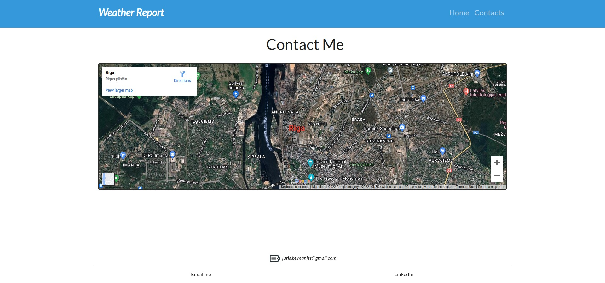

# WeatherReport App

### Past And Current Day Weather In defined location in search bar

### Created with PHP/Twig/Guzzle/Carbon

-----

-----

-----

# How To Set up:

### ! Requirement: 
#### PHP installed on your machine
#### Registered api key from https://www.weatherapi.com/.

----

#### 1. Register on https://www.weatherapi.com/

#### 2. Clone or download to your chosen directory

#### 3. Rename .env.example file to .env

#### 3. Fill API_KEY in the .env file your renamed in root directory with api key from step 1

#### 4. Run command to install required packages

~~~~

composer install

~~~~

### 5. Run with command

~~~~

php -S localhost:8080

~~~~

----